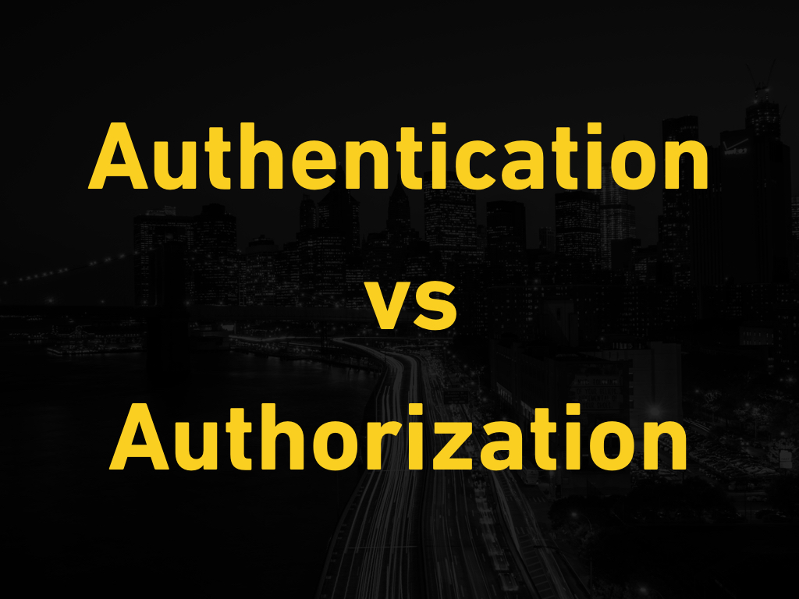
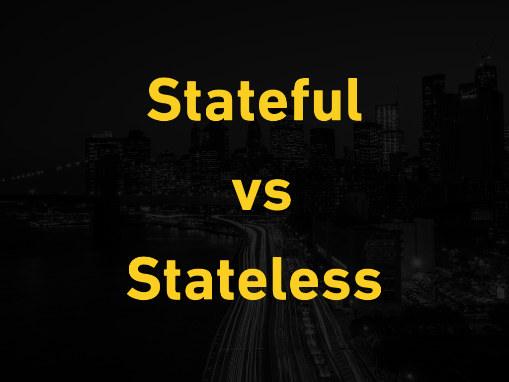
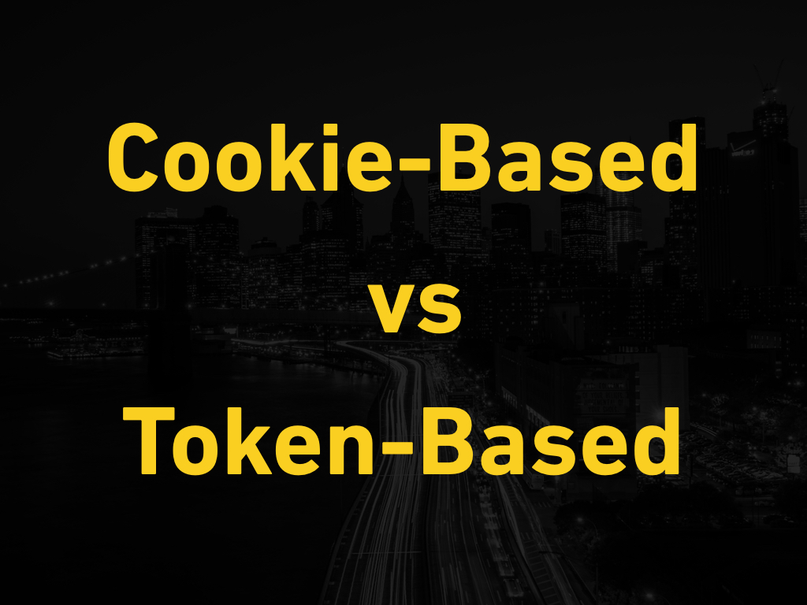

autoscale: true
slidenumbers: true
build-lists: true

---

# [fit] What is User Authentication?

^ This slide should serve to engage students in a discussion about what they think they know about user authentication.
	
---

---

## User Authentication

* the process of validating a user’s credentials against what is saved in the database
* Does the password match what is saved in the database?
* Basically, are you who you say you are?

---

## User Authorization
* the process of determining if a user has access to a certain resource
* Does the user have admin rights?	

---

## Basic Authentication Flow

* User enters their login credentials
* The server queries the user’s info in the database
* If the entered credentials match the saved credentials in the database, the request is processed

---

---

## Stateful Protocol

> …a protocol that requires keeping of the internal state on the server is known as a stateful protocol. - Wikipedia  

---

## Stateless Protocol 

> A stateless protocol does not require the server to retain session information or status about each communications partner for the duration of multiple requests. - Wikipedia  

---

---

## Cookie-Based Authentication

* is stateful
* session is kept both on server and client side
* active session is tracked in database
* cookie on client-side saves the session id

---

## Example

* User submits login credentials
* Server verifies the credentials
* Server creates a session with an unique ID
* Server passes the session ID in a cookie, which is saved in the browser
* The ID in the cookie is verfied against the server, for all subsequent requests
* Session is destroyed when client logs out of app

---

## Token-Based Authentication

* is stateless
* the server does not keep track of which users are logged in or which tokens have been issued
* every request to the server is accompanied with a token

---

## Example

* User submits login credentials
* Server verifies and returns a signed token
* Token is stored client-side, typically local storage
* Subsequent requests include token as an additional Authorization header
* Server decodes the token and if valid, processes the request
* Token is destroyed on client-side when user logs out
